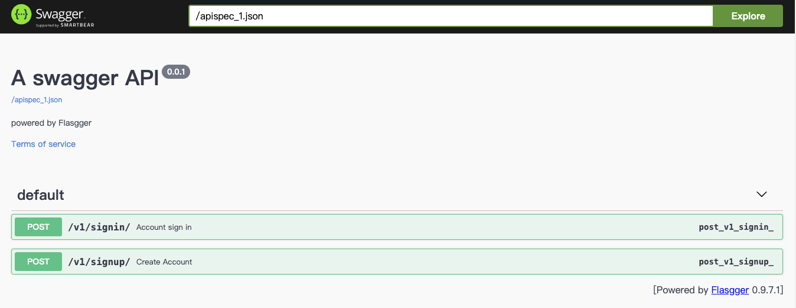
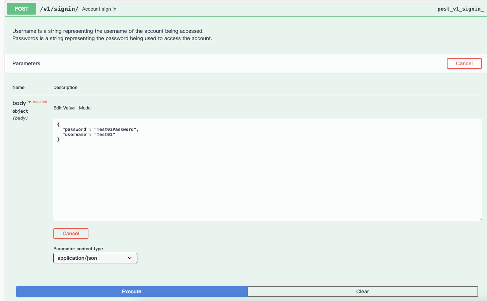
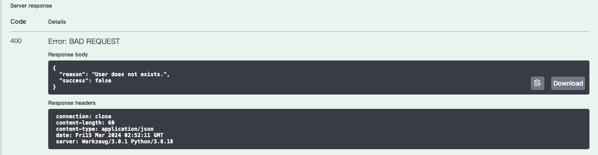
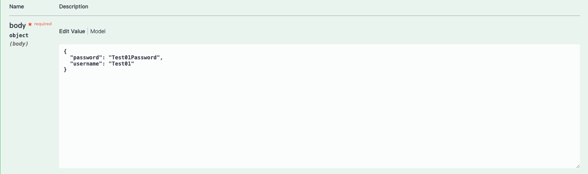
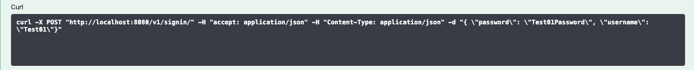

# sn-project
HTTP APIs for Account and Password Management

### Pull the image and Run the container 
Pull the Docker image manually by cloning the Git repo.
Docker hub link: https://hub.docker.com/r/kaiser764/sn-project-api
```
$ git clone https://github.com/kaiser0421/sn-project.git
$ cd sn-project
$ docker compose pull
$ docker compose up
```

Now visit http://localhost:8080/apidocs/  
This is my api document from the code by Flasgger.  
(Flasgger comes with SwaggerUI embedded so you can access http://localhost:8080/apidocs and visualize and interact with your API resources.)
  

### Verify the apis
When you access SwaggerUI you will see two POST apis.  
You can click the api and you will see the button "Try it out".  
Now you can click the button "Execute".  
It will take the default parameter to call the api.  
  

And then you will see the server response like:  
```
{
    "success": true
}
```
or 
```
{
  "reason": "The username and/or password you specified are not correct.",
  "success": false
}
```
  
You also can change the default parameter on body field.  
  
If you want to use the curl cmd to test apis, you can check Curl field.  
SwaggerUI also auto generate the curl cmd.  
```
curl -X POST "http://localhost:8080/v1/signup/" -H "accept: application/json" -H "Content-Type: application/json" -d "{ \"password\": \"TestPasswor\", \"username\": \"Test02\"}"
```
  

### Unittest

You can check unittest result by this cmd.
```
docker exec -t -i sn-project-api-1 python src/tests/test.py
```